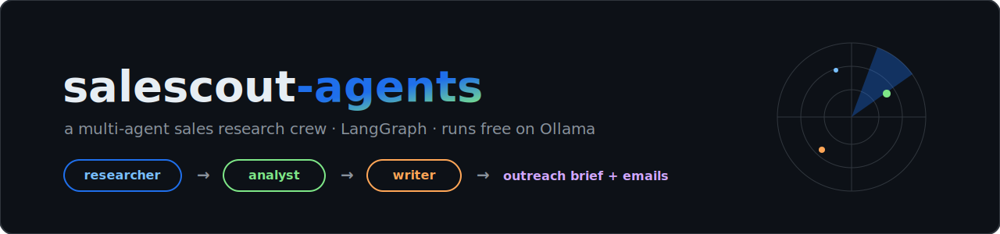
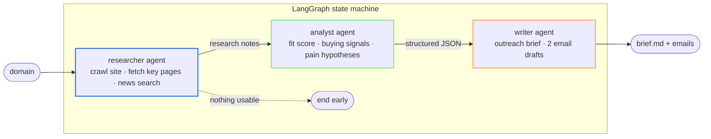

<p align="center">
  
</p>

<p align="center">
  
  
  
  
  
  
  
</p>

**SaleScout** is a multi-agent sales research crew. Give it a company domain and
three specialized agents hand work to each other — crawling the company's site,
scoring the opportunity, and drafting personalized outreach — until a
ready-to-send **outreach brief + two email drafts** land on your desk.

No paid APIs. It runs entirely on a local **Ollama** model, or on **Groq's free
tier** if you want 70B-class speed.

## Why this exists

SDRs spend 15–30 minutes researching each account before writing one email.
SaleScout compresses that to under a minute of agent time, and — unlike a
single-prompt "write me a cold email" — every claim in the output traces back
to something an agent actually read: a page on the company's site or a news hit.

## Architecture



Every agent appends to a shared, append-only **trace** — the UI and CLI show
each handoff, fetch, and decision, so runs are debuggable instead of magical.

## Quickstart (100% free, local)

```bash
# 1. Install Ollama (https://ollama.com), then pull a model
ollama pull llama3.1

# 2. Install dependencies
pip install -r requirements.txt

# 3a. Run the UI
streamlit run app.py

# 3b. ...or the CLI
python cli.py acme.com
```

Optional — swap in Groq's free tier for much faster runs:

```bash
cp .env.example .env     # add your free key from console.groq.com
export GROQ_API_KEY=...  # that's it — provider switches automatically
```

## What a run looks like

```text
SaleScout · target: acme.com · llm: Ollama · llama3.1
  researcher  fetched        https://acme.com
  researcher  fetched        https://acme.com/about
  researcher  news_search    6 results
  researcher  notes_written  3,812 chars
  analyst     scored         fit_score=82
  writer      brief_written  2,304 chars
  writer      emails_drafted 2 drafts

Done. fit_score=82 → briefs/acme_com.md
```

See a full example output: [`examples/sample_brief.md`](./examples/sample_brief.md)

## Configuration

| Variable | Default | Purpose |
|---|---|---|
| `OLLAMA_MODEL` | `llama3.1` | Local model used when no Groq key is set |
| `GROQ_API_KEY` | — | If set, switches provider to Groq free tier |
| `GROQ_MODEL` | `llama-3.3-70b-versatile` | Groq model |
| `SALESCOUT_MAX_PAGES` | `4` | Max site pages crawled per company |
| `SALESCOUT_PAGE_CHARS` | `6000` | Character budget per page |

## Project structure

```text
salescout-agents/
├── app.py                  # Streamlit UI with live agent trace
├── cli.py                  # Typer CLI (rich trace table)
├── src/salescout/
│   ├── state.py            # shared graph state (append-only trace/errors)
│   ├── config.py           # free-provider factory (Ollama ⇄ Groq)
│   ├── tools.py            # polite crawler, text extraction, DDG news search
│   ├── agents.py           # researcher / analyst / writer nodes
│   └── graph.py            # LangGraph wiring + guard edges
└── examples/sample_brief.md
```

## Design notes

- **Guard edges, not hope** — if the researcher can't produce notes, the graph
  ends early with the errors it collected instead of hallucinating a brief.
- **Defensive JSON parsing** — analyst/writer replies are regex-extracted and
  fall back gracefully when a small local model drifts off-format.
- **Polite crawling** — proper User-Agent, redirect handling, page budget, and
  only same-domain key pages (`/about`, `/pricing`, ...).
- **Provider-agnostic** — one env var swaps local Ollama for Groq; no code changes.

## Roadmap

- [ ] CSV batch mode (score a whole lead list overnight)
- [ ] CRM push (HubSpot/Close) behind a `--push` flag
- [ ] Cache layer so re-runs on the same domain are instant

---

<p align="center">Built by <a href="https://github.com/syedahmad0786">Ahmad Bukhari</a> — AI &amp; Automation Architect · <i>agentic systems that run real businesses, not just demos</i></p>
