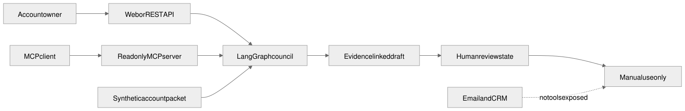

# Revenue Intelligence Council

A four-agent account-research council that qualifies an opportunity and writes evidence-linked outreach drafts without sending email or writing to a CRM.

**Portfolio role:** Agentic AI & LLM Systems Specialist
**Status:** public demo verified on Vercel on 2026-08-03
**Live demo:** https://revenue-intelligence-council.vercel.app
**Verified runtime commit:** `dd8b15194abd085e72c78660f7dfff015fae13b1`
**Safety:** draft-only, replay-first, no send or CRM tool exists

## What this proves

- A typed LangGraph pipeline from research to qualification, strategy, and drafting.
- Evidence IDs attached to every public signal used in a claim or draft.
- Explicit low-fit rejection instead of forced outreach.
- Human approval that marks a draft usable but performs no external action.
- MCP v2 tools for read-only analysis and run retrieval.



## Three-minute walkthrough

1. Choose a synthetic account and run the council.
2. Inspect the research evidence and fit score.
3. Trace the recommended angle and draft back to evidence IDs.
4. Run `low_fit` and confirm the system recommends no pursuit.
5. Approve a draft and verify the counters remain `0 emails` and `0 CRM writes`.

## Verified evaluation

| Check | Result |
|---|---:|
| Synthetic accounts | 10/10 grounded |
| Low-fit suppression | Pass |
| Draft send status | 100% draft-only |
| MCP write tools exposed | 0 |
| Email or CRM mutations | 0 |

Full evidence: [evaluations/REPORT.md](evaluations/REPORT.md).

## Run locally

```powershell
uv sync
uv run uvicorn server:app --reload
uv run python -m unittest discover -s tests -v
uv run python mcp_server.py
```

The MCP server exposes only `get_capabilities`, `analyze_account`, and `read_run` over standard input/output.

## API

- `GET /api/v1/health`
- `GET /api/v1/capabilities`
- `POST /api/v1/accounts/analyze`
- `GET /api/v1/runs/{run_id}`
- `POST /api/v1/runs/{run_id}/decisions`
- `GET /openapi.json`

See [SYSTEM-GUIDE.md](SYSTEM-GUIDE.md) for the exact architecture, MCP boundary, alternatives, deployment, and limitations.

## Repository map

- `src/salescout/council.py`: account fixtures, LangGraph, evidence, proposals, and decisions.
- `mcp_server.py`: read-only MCP v2 surface.
- `server.py`: typed API and responsive stakeholder demo.
- `tests/`: grounding, low-fit, approval, and MCP exposure checks.
- `diagrams/`, `postman/`, `evaluations/`: architecture and proof.
