# Revenue Intelligence Council — System Guide

## 1. Business problem and user

Sales research often mixes public facts, assumptions, qualification, and messaging into one opaque prompt. The account owner then receives copy that looks specific but cannot be defended. This system separates the responsibilities and carries evidence into the final draft.

The public preview uses ten synthetic company packets. It is a decision-support system, not an autonomous outreach system.

## 2. Agent responsibilities

| Agent | Responsibility | Boundary |
|---|---|---|
| Company Researcher | Read the account packet and create hashed evidence records | Cannot qualify or write outreach |
| Opportunity Analyst | Score fit, buying signals, and risks | Low fit must remain visible |
| Message Strategist | Build one angle and evidence-linked claims | Cannot invent company facts |
| Outreach Writer | Draft reviewable wording | Always sets `send_status` to `draft_only` |
| Account Owner Gate | Approve or reject manual use | No send or CRM call follows approval |

## 3. End-to-end data flow

1. A browser, REST client, or MCP client chooses a named synthetic account.
2. The researcher creates evidence records from signals and risks.
3. The analyst computes a deterministic fit decision.
4. The strategist attaches evidence IDs to every public claim.
5. The writer references only those claims and returns a draft.
6. The account owner can approve or reject manual use; mutation counters remain zero.

## 4. REST and MCP contracts

FastAPI provides the HTTP contract and generated OpenAPI. The start route is `POST /api/v1/accounts/analyze`; decisions use `POST /api/v1/runs/{run_id}/decisions`.

The MCP v2 server is intentionally narrower:

| MCP tool | Purpose |
|---|---|
| `get_capabilities` | Describe replay mode and the no-mutation boundary |
| `analyze_account` | Run one named replay with an idempotency key |
| `read_run` | Retrieve a run created in the same MCP process |

There is no MCP approval, email, CRM, browser, arbitrary URL, or credential tool. This prevents an MCP client from turning a portfolio demonstration into an action channel.

## 5. State, memory, and persistence

LangGraph state contains fixture, evidence, analysis, strategy, drafts, and execution trace. The system uses no long-term conversational memory. REST and MCP process instances each keep their own in-memory run store.

Production persistence maps to the `portfolio_revenuecouncil` Postgres schema with immutable evidence and a unique idempotency key. A CRM identifier should remain a reference, not a copied customer profile.

## 6. Security, approvals, and failure boundaries

- Only named synthetic scenarios are accepted in the public deployment.
- Live research is disabled without provider approval.
- Evidence is hashed and addressed by ID.
- Low-fit accounts are not forced into a positive recommendation.
- REST approval changes only the local status.
- MCP stays read-only and cannot call REST approval.
- No email or CRM client is installed or configured.
- Public rate, concurrency, step, and timeout limits apply.

## 7. Deployment and observability

The HTTP surface deploys to Vercel. MCP is a local or hosted standard-input/output interface and is not exposed through the public web route. CI runs ten account scenarios, tool-exposure tests, API contracts, Postman, and desktop plus 390-pixel browser checks before preview promotion.

Production tracing should record node names, fit score, evidence count, status, latency, and model usage. Company text and draft bodies should not be copied into unrestricted spans.

## 8. Cost controls

Synthetic replay uses no model or research calls. Optional live research can use Tavily and OpenRouter only after a key, privacy review, and cost ceiling are supplied. The free route is never treated as a dependable production service.

## 9. Alternatives considered

| Decision | Selected | Why here | Alternative and reason not selected |
|---|---|---|---|
| Orchestration | LangGraph | Each stage owns typed state and has an observable handoff | One large prompt makes grounding and low-fit behavior harder to test |
| Interoperability | Read-only MCP plus REST | MCP proves governed agent tools; REST serves browsers and Postman | Exposing write tools would create risk without portfolio value |
| API | REST/JSON with FastAPI | Typed resources and OpenAPI are easy to demonstrate | GraphQL and gRPC add client overhead |
| Qualification | Deterministic fit gate | Low-fit behavior is reproducible | Model-only qualification can rationalize weak opportunities |
| Integrations | None in public preview | The system proves decisions without touching real systems | CRM and email adapters belong in a separately approved integration |
| Model routing | Existing OpenRouter-compatible adapter | One client can select an available free model | Hardcoding one free model creates availability drift |

## 10. Agent collaboration

The pipeline is sequential because a later artifact must be grounded in the prior artifact. Research can become parallel when live source diversity is added, while qualification, strategy, and drafting remain ordered.

## 11. Known limitations and production requirements

- Current company information and outcomes are synthetic.
- Run and decision history is not durable across serverless or MCP processes.
- The fit score is a portfolio heuristic, not an audited sales model.
- Production needs authentication, durable storage, source policies, prompt-injection controls, consent, CRM field mapping, suppression lists, monitoring, and a separate send approval process.
